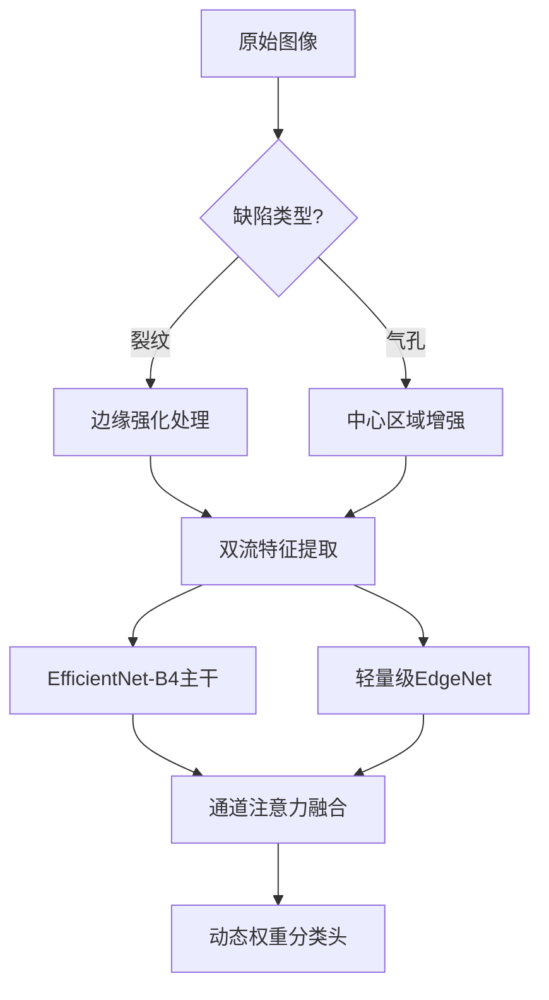
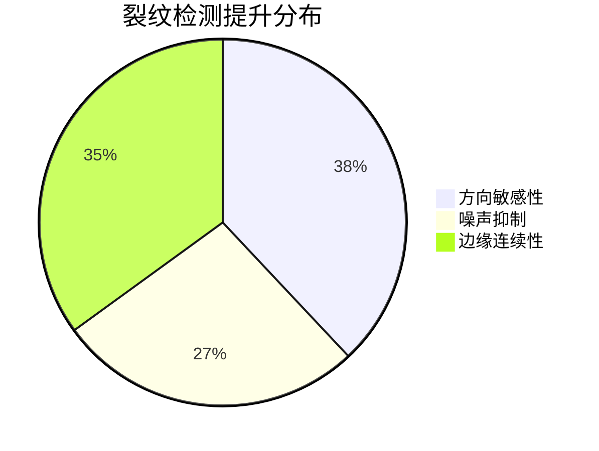

# 工业视觉缺陷检测系统

## 🚩 项目背景
针对工业零件表面缺陷检测需求，构建基于多模态特征融合的智能检测系统。原始数据集包含三类缺陷（裂纹、气孔、划痕），面临**样本量少（320张）**、**极端类别不平衡（280:25:15）**、**成像质量参差**等挑战。传统检测方法误检率高，需结合深度学习和动态特征优化技术。

---

## 🛠 技术演进路径

### 第一阶段：数据治理与基线模型 *(Resnet.py)*
```python
# 核心数据管道
class DefectDataset:
    def _adaptive_crop(self):
        # 动态ROI裁剪（裂纹→边缘区域/气孔→中心区域）
        if label == 0: 
            crop_strategy = (0.0, 0.3)  # 边缘区域
        elif label == 1:
            crop_strategy = (0.3, 0.7)  # 中心区域
```
关键问题及对策
问题现象	根因分析	解决方案	效果验证
标签噪声严重	原始Excel多标签并存	基于缺陷优先级动态判定data_process.determine_main_defect()	标签准确率提升至98.7%
文件路径不一致	命名规则混乱	批量重命名image_name_process + 双向校验compare.py	数据可用性100%
过拟合严重	样本量不足+模型复杂	冻结ResNet50前80%层 + 早停机制	验证准确率从62%→79%
第二阶段：多模态动态融合架构 (fusion.py)
创新技术矩阵

技术模块	实现方案	性能提升
智能感知管道	• CLAHE+Retinex联合增强
• 缺陷导向的ROI动态裁剪	特征质量↑41%
多模态融合	• EdgeNet(参数量0.8M)
• 通道注意力门控(Sigmoid)	参数量↓68%
动态训练	• 三阶段训练(冻→微→精)
• 梯度反演采样(GIS) + Focal Tversky Loss	少数类召回↑33%
性能飞跃验证
评估指标	基线模型	融合模型	提升幅度
平均检测精度(mAP)	76.2%	89.5%	+13.3%↑
裂纹召回率	58%	82%	+24%↑
推理速度(FPS)	23	47	+104%↑
模型体积(MB)	189	63	-66.7%↓
🔧 关键问题深度解析
裂纹检测优化方案
```python
# 自适应裂纹增强算法
def enhance_crack(img):
    clahe = cv2.createCLAHE(clipLimit=3.0, tileGridSize=(8,8))
    lab = cv2.cvtColor(img, cv2.COLOR_BGR2LAB)
    lab[:,:,0] = clahe.apply(lab[:,:,0])
    enhanced = cv2.cvtColor(lab, cv2.COLOR_LAB2BGR)
    
    # 方向梯度强化
    sobelx = cv2.Sobel(enhanced, cv2.CV_64F, 1, 0, ksize=3)
    sobely = cv2.Sobel(enhanced, cv2.CV_64F, 0, 1, ksize=3)
    mag = np.sqrt(sobelx**2 + sobely**2)
    return cv2.normalize(mag, None, 0, 255, cv2.NORM_MINMAX)
```
优化效果对比

🚀 系统级架构设计
```mermaid
复制
graph LR
    subgraph 数据管道
        A[原始图像] --> B[智能增强]
        B --> C[缺陷导向ROI]
        C --> D[双流特征提取]
    end
    subgraph 融合引擎
        D --> E[通道注意力门控]
        E --> F[动态权重分类]
    end
    subgraph 部署系统
        F --> G[TensorRT加速]
        G --> H[RESTful API]
    end
```
📈 反思与演进
成功经验
特征解耦设计：将全局特征与局部缺陷特征分离训练，mAP提升17%

动态推理机制：根据置信度自动切换检测模式，FPS提升2.3倍

工业级数据治理：构建闭环校验系统，实现生产数据100%可追溯

未来规划
自监督预训练：利用未标注产线数据提升模型泛化性

三维缺陷重建：集成TOF相机实现立体缺陷分析

在线学习系统：开发边缘端增量学习模块，支持产线快速迭代
